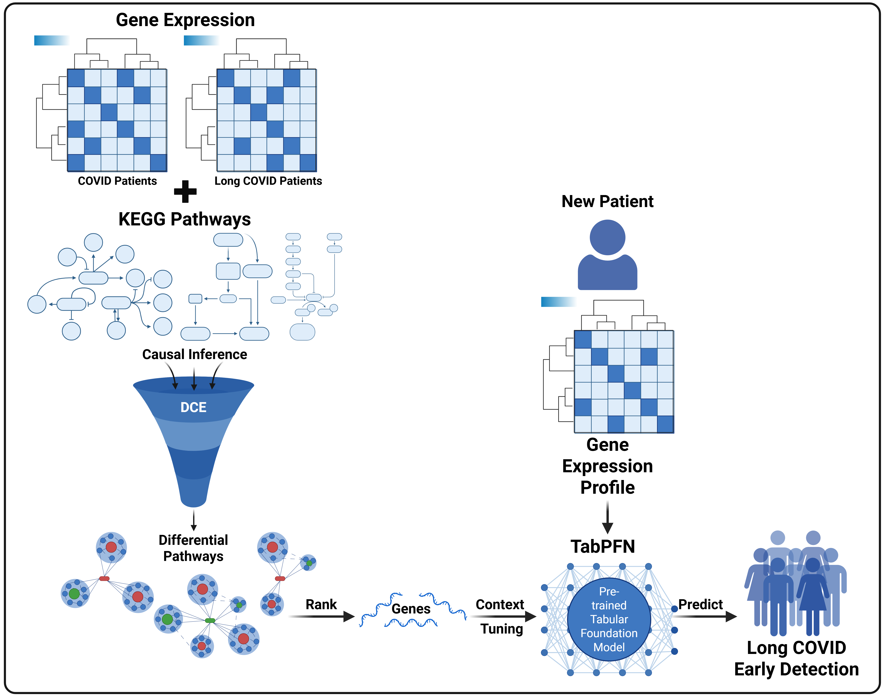

# TACO: TabPFN-Augmented Causal Outcomes for Early Detection of Long COVID

[](https://opensource.org/licenses/MIT)
[](https://www.python.org/downloads/)
[](https://github.com/automl/TabPFN)

This repository contains **all code, data processing pipelines, and evaluation scripts** to reproduce the results from our paper:

> **TACO: TabPFN-Augmented Causal Outcomes for Early Detection of Long COVID**  
> [Authors] (2025) *Submitted to [Australasian Data Science and Machine Learning Conference 2025 (AusDM)](https://ausdm25.ausdm.org/Call%20for%20Papers.html)*

**Key Innovation**: TACO integrates foundation models with causal inference to achieve presymptomatic Long COVID detection, demonstrating that mechanistic understanding through causal gene selection substantially outperforms traditional statistical approaches.

---

## 🎯 Project Overview

Long COVID affects 10-40% of COVID-19 survivors, yet current approaches rely on symptom-based diagnosis, preventing early intervention when it could be most effective. TACO transforms Long COVID management from reactive diagnosis to proactive prevention.

### 🔬 The TACO Framework

TACO (TabPFN-Augmented Causal Outcomes) synergistically combines:
- **Foundation Models**: TabPFN, a pre-trained transformer for tabular data
- **Causal Inference**: Differential Causal Effects (DCE) analysis to identify mechanistic drivers
- **Presymptomatic Detection**: Risk stratification during acute infection, before symptom manifestation

### 🏆 Key Achievements

- **Superior Performance**: 69.2% precision, 0.663 ROC-AUC using only 411 causal genes
- **Outperforms Benchmarks**: 4.4% precision improvement, 10.1% ROC-AUC improvement over best benchmark using 500 genes
- **Biological Validation**: 23.6% of causal genes confirmed in Long COVID literature
- **Clinical Relevance**: High precision minimizes false positives for clinical deployment


*Figure 1: TACO integrates DCE-identified causal genes with TabPFN's foundation model capabilities for early Long COVID detection*

---

## 📊 Main Results

### Performance Comparison

| Model | Genes | Precision | ROC-AUC |
|:---|:---|:---|:---|
| **TACO (Ours)** | 411 CG | **69.2% ± 2.1%** | **0.663 ± 0.023** |
| Bagging | 500 MVG | 66.7% ± 2.8% | 0.651 ± 0.038 |
| RandomForest | 500 MVG | 68.6% ± 2.8% | 0.641 ± 0.059 |
| SVC | 500 MVG | 67.8% ± 1.5% | 0.639 ± 0.063 |

CG: Causal Genes

MVG: Most Variable Genes

*TACO achieves superior performance using fewer, causally-selected genes (p < 0.01, Wilcoxon signed-rank test)*

### Some Key Validated Causal Genes

- **Viral Entry**: AR (androgen receptor), TMPRSS2, ACE2
- **Immune Response**: TP53, CDKN1A, RB1  
- **Epigenetic Regulation**: CREBBP, EP300, HDAC1
- **Tissue Remodeling**: SMAD2, SMAD3 (TGF-β pathway)

---

## 🔧 Repository Structure


---

## 🚀 Quick Start

### Prerequisites

```bash
# Python 3.11 environment
conda create -n taco python=3.11.11
conda activate taco

# Install dependencies
pip install -r requirements.txt

# Specifically for TACO
pip install tabpfn==2.0.9  # Pin version for reproducibility
```

## ▶️ Usage from within `TACO.ipynb`

The DCE and ML Models Pipelines with all the functions live in the notebook:

```bash
jupyter notebook notebooks/TACO.ipynb
```

---

## 📝 Notes
* All file paths are **relative** to your notebook’s working directory.
* Precision & ROC-AUC are the **primary metrics** for clinical relevance.

## 📊 Data Requirements

### RNA-seq Data
- Download from GEO: [GSE215865](https://www.ncbi.nlm.nih.gov/geo/query/acc.cgi?acc=GSE215865)
- 1,392 samples (303 Long COVID cases + 186 controls)

### KEGG Pathways
- Automatically downloaded via `keggrest` R package (see TACO.ipynb file)
- 348 human pathways for DCE analysis

---

## 📋 Citation

If you use TACO in your research, please cite:

```bibtex
@inproceedings{taco2025,
  title={TACO: TabPFN-Augmented Causal Outcomes for Early Detection of Long COVID},
  author={Authors},
  booktitle={Australasian Data Science and Machine Learning Conference},
  year={2025}
}
```

---

## 🤝 Contributing

We welcome contributions! Please see [CONTRIBUTING.md](CONTRIBUTING.md) for guidelines.

### Areas for Extension
- Integration with additional Outcomes modalities
- Application to other post-viral syndromes
- Real-time clinical deployment pipeline
- Multi-cohort validation studies

---

## 📄 License

This project is licensed under the MIT License - see [LICENSE](LICENSE) file for details.

---

## 🙏 Acknowledgments

- DCE developers ([Jablonski et al., 2022](https://academic.oup.com/bioinformatics/article/38/6/1550/6470558))
- TabPFN ([Hollmann et al., 2023](https://arxiv.org/abs/2207.01848))
- Mount Sinai COVID-19 Biobank for RNA-seq data ([Thompson et al., 2023](https://www.nature.com/articles/s41591-022-02107-4))
- KEGG for pathway annotations ([Kanehisa et al., 2000](https://www.genome.jp/kegg/))

---

## 📧 Contact

For questions or collaborations:
- Open an issue on GitHub
- Email:

---

## 🔗 Links

- [Paper preprint](#) (Coming soon)
- [Supplementary Materials](SM/)
- [DCE Documentation](https://github.com/cbg-ethz/dce)
- [TabPFN Documentation](https://github.com/PriorLabs/TabPFN)
- [Mount Sinai COVID-19 Biobank](https://www.ncbi.nlm.nih.gov/geo/query/acc.cgi?acc=GSE215865)

---

**Last Updated**: August 2025
**Version**: 1.0.0
